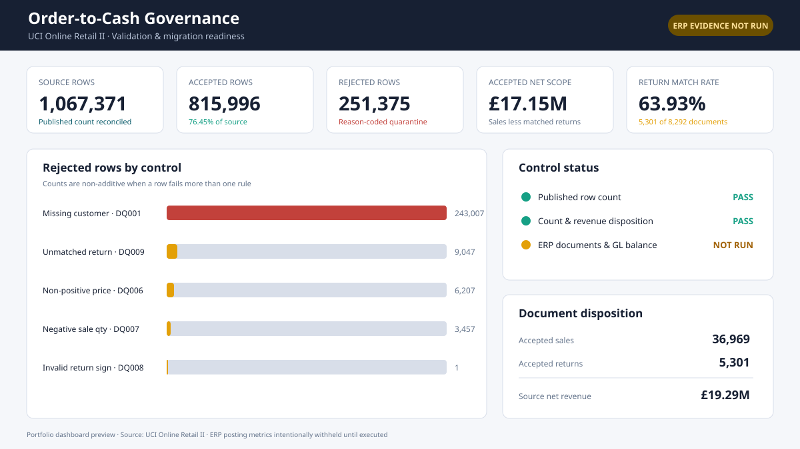
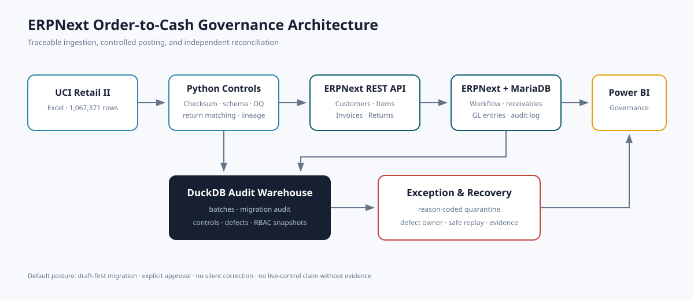

# ERPNext Order-to-Cash Governance, Migration & QA Audit

An evidence-first ERP migration project built on the published **UCI Online Retail II** dataset: **1,067,371 real UK retail transaction rows** spanning December 2009 through December 2011.



## What this project proves

- The exact UCI archive is downloaded, checksum-controlled, and gated to its published row count.
- Customer, item, invoice, and cancellation data is transformed into ERPNext REST payloads with source lineage.
- Invalid rows are quarantined with complete reason codes instead of silently dropped or repaired.
- File and document replay are controlled through SHA-256, source keys, payload hashes, and a migration audit.
- SQL controls cover source/ERP reconciliation, GL balance, duplicates, and segregation of duties.
- UAT, regression, mapping, traceability, RBAC, defects, reconciliation, and recovery evidence are version controlled.
- A Power BI implementation kit exposes accepted/rejected records, control failures, reconciliation, returns, defects, and QA status.



## Observed source results

These figures come from executing the pipeline on the downloaded UCI workbook:

| Metric | Result |
|---|---:|
| Source rows | 1,067,371 |
| Source invoices | 53,628 |
| Known customers | 5,942 |
| Item codes | 5,304 |
| Source net revenue | £19,287,250.57 |
| Accepted rows | 815,996 |
| Rejected rows | 251,375 |
| Accepted net ERP scope | £17,148,219.34 |
| Accepted return documents | 5,301 |

The count and signed revenue disposition reconcile exactly to source. A controlled live ERPNext 16.50.0 UAT was also executed on 2026-10-07: the HTTP health check returned 200, a £39.90 invoice and linked -£39.90 credit note were submitted, each voucher balanced at £40.00 debit and credit, and the integration-only user was denied submit permission. The full 42,270-document accepted population was intentionally **not** posted to the portfolio environment.

## Architecture and controls

`UCI archive → canonical Parquet → Python validation → accepted/rejected staging → ERPNext API → MariaDB/GL → DuckDB audit warehouse → Power BI`

Returns do not assume that removing the source `C` prefix reveals an original invoice. Each line is matched to the nearest prior sale for the same customer, item, and price with sufficient quantity; a cancellation is accepted only when every line resolves to one original invoice.

## Quick start

```powershell
python -m pip install -e ".[dev]"
otc-audit acquire
otc-audit validate
otc-audit build-audit
python scripts/build_dashboard_data.py
python -m pytest
```

Start the ERP audit environment:

```powershell
Copy-Item .env.example .env
# Replace the development passwords and later add a dedicated API key/secret.
docker compose config --quiet
docker compose up -d
python scripts/configure_erpnext.py
python scripts/migrate_to_erpnext.py --batch-id <BATCH-ID> --limit 10
```

Draft creation is the default. Enable submission only after reviewing a controlled UAT sample, access assignments, period status, and reconciliation.

The reproducible live accounting check used for this repository is:

```powershell
docker compose cp scripts/live_erpnext_uat.py backend:/home/frappe/frappe-bench/apps/erpnext/erpnext/live_otc_uat.py
docker compose exec -T backend bench --site frontend execute erpnext.live_otc_uat.run
```

See [the live verification report](docs/11_live_verification_report.md) for the exact document IDs, GL totals, SQL cross-checks, and scope boundary.

## Repository guide

| Path | Contents |
|---|---|
| `src/otc_audit/` | Acquisition, validation, warehouse, REST payloads, migration, dashboard facts, CLI. |
| `sql/controls/` | Data-quality, reconciliation, GL-balance, and access-conflict controls. |
| `erpnext/` | Lineage custom fields, roles/workflow design, environment guide. |
| `docs/` | Requirements, mapping, RTM, test plan, RBAC, defect log, reconciliation, runbook. |
| `powerbi/` | Power Query, DAX measures, theme, and four-page dashboard specification. |
| `tests/` | pytest unit and regression coverage. |
| `docker-compose.yml` | Pinned ERPNext v16 + MariaDB + Redis + workers + scheduler + frontend. |

## Data provenance and license

Dataset: [UCI Online Retail II](https://archive.ics.uci.edu/dataset/502/online%2Bretail%2Bii), DOI [10.24432/C5CG6D](https://doi.org/10.24432/C5CG6D), licensed CC BY 4.0. The archive is downloaded locally and intentionally excluded from Git.

ERP references: [ERPNext accounting entries](https://docs.frappe.io/erpnext/accounting-entries), [Frappe REST API](https://docs.frappe.io/framework/user/en/api/rest), and the official [Frappe Docker environment](https://github.com/frappe/frappe_docker).

## Honest scope statement

This is a portfolio implementation using real public transaction data and a locally reproducible ERPNext configuration. It is not a production migration, does not contain a real retailer's named customers, and does not claim production approval, Power BI Service deployment, or a full-population ERP migration. Live ERP/GL claims are limited to the documented controlled UAT sample.

