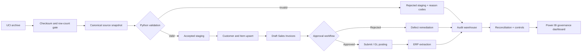

# Order-to-cash migration process map

## Control points

| Gate | Owner | Preventive/detective | Failure route |
|---|---|---|---|
| Archive SHA-256 uniqueness | Integration operator | Preventive | Stop duplicate batch. |
| Schema and published row count | Data engineer | Preventive | Fail acquisition. |
| Row validation | Data steward | Preventive | Quarantine with DQ codes. |
| Source invoice uniqueness | Integration service | Preventive | Skip same payload; defect on changed payload. |
| Approval workflow | OTC approver | Preventive | Reject to preparer. |
| GL balance | Finance auditor | Detective | High-severity defect and posting hold. |
| Count and revenue reconciliation | Data/finance owners | Detective | Investigate mapping, missing docs, or rounding. |
| Segregation of duties | Security administrator | Preventive/detective | Remove conflicting role before approval. |

